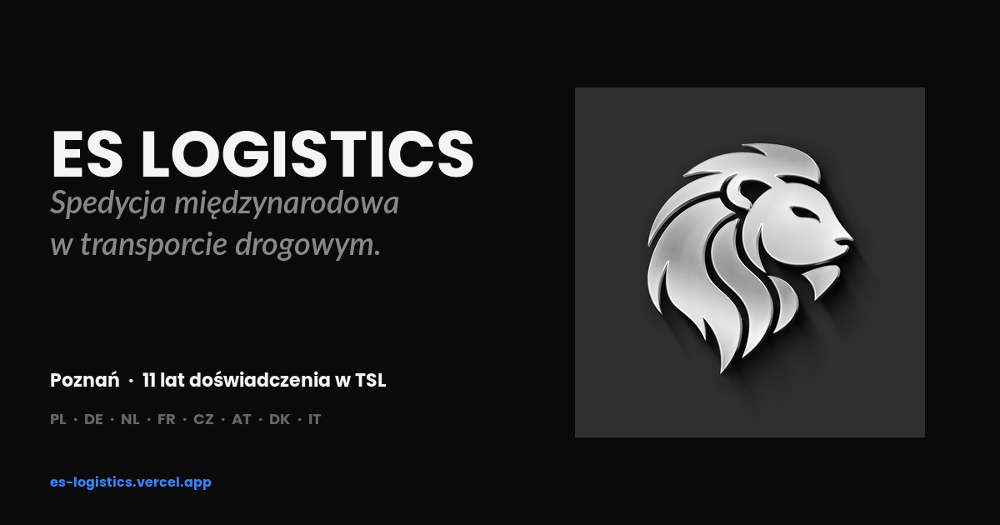

# ES Logistics — strona internetowa

Strona internetowa firmy spedycyjnej **ES Logistics Sp. z o.o.** z Poznania.

🌐 **Live:** [es-logistics.vercel.app](https://es-logistics.vercel.app)



---

## Stack

- HTML + CSS + JavaScript (vanilla)
- React 18 + JSX (kompilacja w przeglądarce przez Babel-standalone — będzie zmienione na build-time przed produkcją)
- Tailwind-style design tokens (CSS variables, monochromatyczna paleta zgodna z księgą znaku)
- Hosting: Vercel (auto-deploy z GitHub)

## Struktura

```
ES-LOGISTICS/
├── README.md                   # ten plik
└── website/                    # właściwa aplikacja (Root Directory na Vercel)
    ├── index.html              # Entry point
    ├── start-here.html         # Single-file backup (do testów lokalnych)
    ├── styles.css              # Design tokens + komponenty
    ├── components.jsx          # Header, Footer, Lion, hooks
    ├── pages.jsx               # HomePage, AboutPage, ServicesPage
    ├── forms.jsx               # ClientPage, CarrierPage, ContactPage, LegalPage
    ├── tweaks-panel.jsx        # Live tweaks (panel deweloperski, ukryty na produkcji)
    ├── assets/
    │   ├── lew.png             # Godło z księgi znaku
    │   ├── logo.png, napis.png # Inne warianty logo
    │   ├── og-image.png        # Open Graph preview (1200×630)
    │   └── photo-*.jpeg        # Zdjęcia firmowe
    ├── INSTRUKCJA-DEPLOY-VERCEL.md
    ├── INSTRUKCJA-GITHUB.md
    └── README.md               # Szczegóły techniczne projektu
```

## Sekcje strony głównej

1. **Hero** — animowane tło (Ken Burns), 3 warianty hasła
2. **Marquee** — przewijający się pasek 16 krajów obsługi
3. **Usługi** — 4 filary (spedycja międzynarodowa, transport, dokumentacja, logistyka kontraktowa)
4. **Trust bar** — 11 lat doświadczenia, zasięg europejski, biuro w Poznaniu, obsługa PL/EN/DE
5. **Dlaczego ES** — 6 wartości
6. **W liczbach** — animowane liczniki
7. **Kierunki obsługi** — siatka 12 krajów EU
8. **Zaufali nam** — anonimizowane opisy klientów (do podmiany na logotypy)
9. **FAQ** — 6 najczęstszych pytań (accordion)
10. **Kontakt** — dane teleadresowe + mapa

Plus 6 podstron: O nas, Usługi, Dla klienta (formularz zapytania), Dla przewoźnika (formularz rejestracji), Kontakt, Legal.

## Workflow

```bash
# Edycja lokalna
cd website
# zmień co trzeba w styles.css / pages.jsx / itd.

# Push do GitHub
git add .
git commit -m "opis zmiany"
git push

# Vercel automatycznie redeployuje w 30-60 sek
```

## Status

✅ **Wersja MVP gotowa** — można pokazać klientowi
🔧 **Do uzupełnienia:** dane teleadresowe (telefon, NIP/REGON/KRS), realne statystyki, logotypy klientów, ewentualnie wersje EN/DE i prerendering dla SEO
📅 **Najbliższe kroki:** akceptacja klienta → uzupełnienie treści → podpięcie domeny `eslogistics.pl`

## Brand

Zgodnie z księgą znaku ES Logistics:
- Paleta: monochromatyczna (#FFFFFF → #000000)
- Akcent: konfigurowalny (mono / blue #3B82F6 / emerald / amber)
- Fonty: **Barlow** (nagłówki, italic) + **Outfit** (treść)
- Logo: lew z księgi znaku, używany w hero i corner-watermark

---

© 2026 ES LOGISTICS Sp. z o.o. · ul. Kopanina 28/32, Poznań
